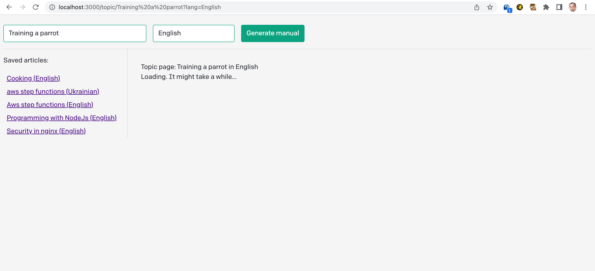
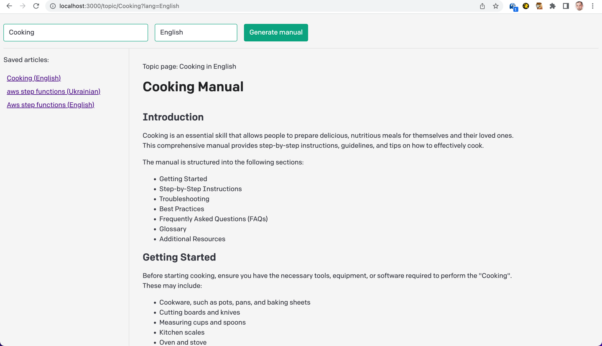
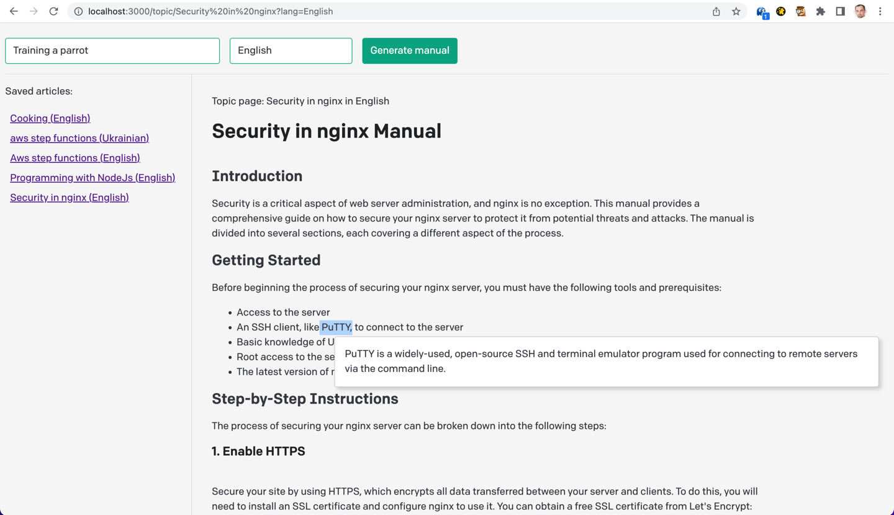
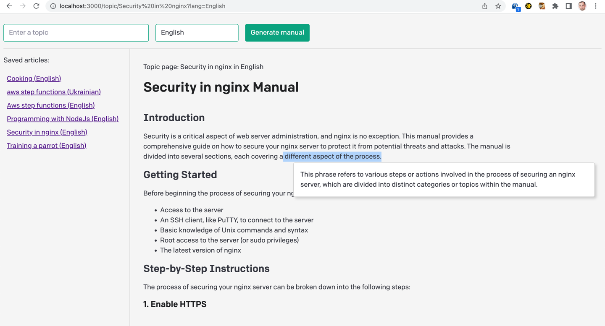

# AI Manuals

This is an open project that aims to provide modern Neural Networks powered trainings/manuals on any topic.

Based on OpenAI API example nextjs repo.

### Quick start:

* clone
* add `.env` file with `OPENAI_API_KEY` ( see official doc: https://platform.openai.com/docs/quickstart/add-your-api-key )
* `npm i`
* `npm run dev`

### Description and slides on current state:

The current version allows a user to generate a manual on any topic, and then to get an explanation on any part of the initial answer with minimum clicks amount. it also stores all your manuals in a file locally for easy and fast access.

The basic UI looks like this (technical design, sorry):

And them when it finishes the generation like this:

It also can explain any part of the manual - select any text and it will generate you an explanation based on the manual:

Explanations are given with the context of the manual itself:

**Header** has 2 inputs form:  

1. The topic you are interested in like `"Security in nginx"` or `"Programming with NodeJS"`
2. The language you want your manual to be in. This defaults to `English` .

Upon submitting it will either generate a manual using OpenAI APIs, or just return a cached manual if it has one

**The Sidebar** on the left shows all the cached manuals the system has for fast and easy access.

And finally **the content window** shows the manual itself

### What it should be like ( plans? ):

1. **Quality of prompts** - the prompts this use right now are made with ChatGPT help and ok, but could be better.
2. **Manuals generation approach** - right now it generates the whole manual in one big request - I feel it is worth trying to generate appendix first, and then generate each section separately as user reads.
3. **Sections with links** - the good manual should have sections and an ability to navigate them
4. **Separate manuals, docs, and trainings** - There is difference between a need in a quick reminder vs the full learning
5. **Interactive steps** - It would be great to have sort of exams powered by the same OpenAI APIs - and it can do this quite well!
6. **Media** - generate images or get across internet
7. **Deploy as a service** with accounts - google OAuth is enough 
8. **Sharing good manuals**
9. **Curated manuals**
10. **Anything** - just anything :)
